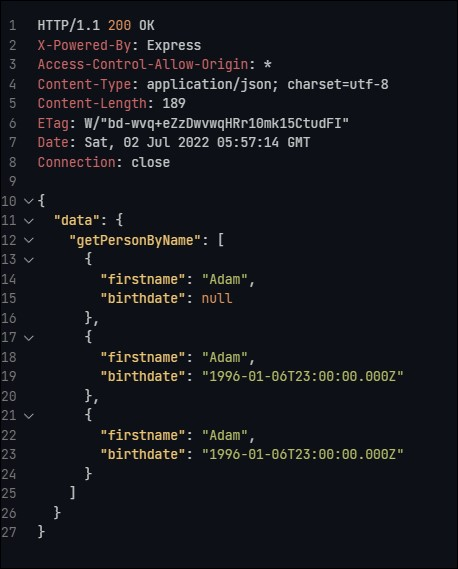
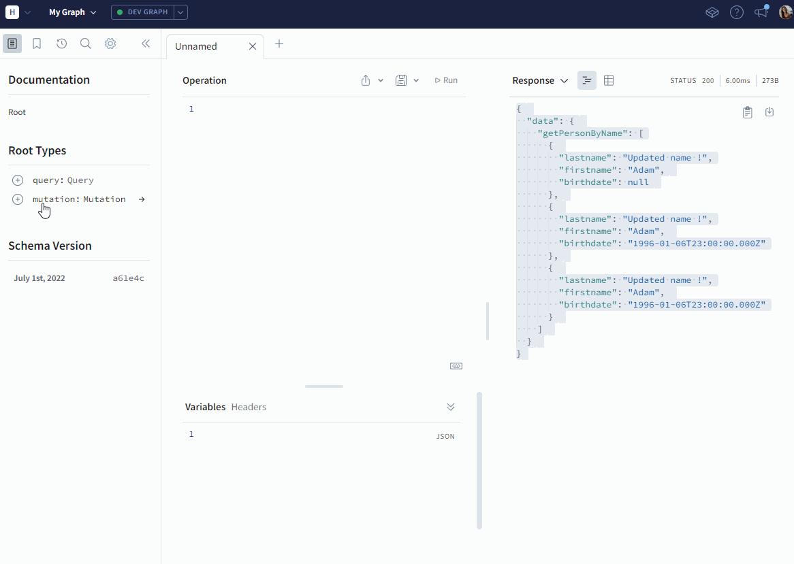

# O'Qlo - API

Author: Yumicode

## Introduction

From this little API, we only want to get :

- lastname
- firstname
- birthdate

We will use GraphQL with [Apollo Server](https://www.apollographql.com/docs/apollo-server/) which is an open-source spec-compliant GraphQL server and use a Schema Definition Language (SDL).

With GraphQL, developers can fetch only what is required and you define the exact fields that you want to fetch and it fetches the data of onlu these fields.

The architectures of GraphQL is different from Restful API.

Below, you'll find differences between the 2 ways (thanks [O'Clock school](https://oclock.io/) for the table)

|REST 📋|GraphQL 🧬|
|:-:|:-:|
|<u>-- **To embed** --</u>||
|Connect to DB|Connect to DB|
|Model|Model|
|Controller|Resolver|
|Logger|Logger|
|JWT|JWT|
|<u>-- **Schema GraphQL** --</u>||
|Validation|-|
|Route|-|
|Swagger Doc|-|
|<u>-- **Apollo Server functionnalities** --</u>||
|Exception|-|
|Error Handler|-|

As you can see, GraphQL includes validations from the body, there is only one route, everything is done to make it easy to use.

So let's see how does it works !

## GraphQL and Apollo Server

Let's create a simple API with only one table.

First of all, you need to create a folder where we initialize npm

```
npm init
```

We will need some dependencies :

- apollo-express-server (ro use ApolloServer)
- pg (to connect to the database)
- dotenv (to define and use environment variables)
- express (to make our server works !)

```
npm i apollo-express-server pg dotenv express
```

And here our folder structure :


### Create and seed our database

Before launching our server and make our awesome queries, we need to create our database.

I'm using Postgres, here steps I did :

- connect with postgres

```sh
psql -U postgres
```

- create role with password

```sql
CREATE ROLE role_name WITH LOGIN PASSWORD 'password';
```

- create the database

```sql
CREATE DATABASE database_name OWNER 'role_name';
```

And create our simple table :

```sql
CREATE TABLE IF NOT EXISTS person (
    firstname TEXT NULL,
    lastname TEXT NULL,
    birthdate DATE NULL
);
```

And seed it :

```sql
INSERT INTO public.person(
 lastname, firstname, birthdate)
 VALUES 
    ('Mélisande' ,'Hubert', '1/01/1990'),
    ('Lydie', 'Henry' , '2/01/1991'),         
    ('Florie', 'Le gall', '3/01/1992'),       
    ('Alexandre' ,'Dupont' ,'4/01/1993'),      
    ('Mireille' ,'Roche',  '6/01/1994'),        
    ( 'Longin', 'Adam','7/01/1996' ),        
    ('Apollinaire', 'Berger','8/01/1997' ),     
    ('Émilie', 'Brun' , '9/01/1997'),       
    ('Charline', 'Jacquet', '10/01/1998' );
```

Result on PgAdmin (version 4)


### Index entry point for our server

Everything will start on our main file which is main index.js (or app.js or server.js).

Let's see how to configure it with Apollo Server :

```js
//~environment
import 'dotenv/config';

//~import modules
// CommonJS
// const express = require('express');
import express from 'express';
const app = express();
// CommonJS
// const { ApolloServer } = require("apollo-server-express");
import { ApolloServer } from 'apollo-server-express';

//~import schema and resolvers 
// CommonJS
// const typeDefs = require("./app/schema");
// const resolvers = require("./app/resolver");
import { schema } from './app/schema.js';
const typeDefs = schema ;

import { Query, Mutation } from './app/resolver.js';
const resolvers = { Query, Mutation };

const server = new ApolloServer({
  typeDefs,
  resolvers
});

const PORT = process.env.PORT ?? 3000;

//~Start Apollo Server
async function startServer() {
//Start instance Apollo Server
  await server.start();
// Link Express with Apollo server
  server.applyMiddleware({app});

    await app.listen(PORT);
    console.log(`🚀 Server launched on http://localhost:${PORT}`);

};

startServer();
```

First of all, import dotenv to read your `.env` file with your environment variables.

And then import your Express module.

`apollo-server-express` is the Apollo Server package for Express, the most popular Node.js web framework. It enables you to attach a GraphQL server to an existing Express server. Then you can use it on the same server.

Your GraphQL server uses a schema to describe the shape of your available data.

The `schema` define all types used from the database and `resolvers` are responsible for populating the data  in any way you define by fetching data from database or a third-party API.

To start you server, you create an instance of the Apollo Server and to bind it with Express, you need to use `applyMiddleware` and then, launch the server

```js
const PORT = process.env.PORT ?? 3000;

//~Start Apollo Server
async function startServer() {
//Start instance Apollo Server
  await server.start();
// Link Express with Apollo server
  server.applyMiddleware({app});

    await app.listen(PORT);
    console.log(`🚀 Server launched on http://localhost:${PORT}`);

};

startServer();
```

### Connect your database

In your file dbClient, you need to create connection with your database :

```js
import pg from 'pg';

const client = new pg.Client();
client.connect();

export {client};
```

### Datamapper

First, you need to create your queries in your datamapper to use it.

For our API, we will do CRUD operations on the database

- Read datas

```js
//~FETCH DATA
  async findAll() {
    const result = await client.query('SELECT * FROM "person";');

    return result.rows;
  },

  async findByName(name) {
    const result = await client.query(`SELECT * FROM "person" WHERE "firstname" = $1;`, [name]);

    return result.rows;
  },

  async findByDate(birthdate) {
    const result = await client.query('SELECT * FROM "person" WHERE "birthdate" = $1;', [birthdate]);

    return result.rows;
  },
```

- Create data

```js
//~CREATE DATA
  async insertPerson(person) {
    const preparedQuery = `INSERT INTO "person" ("firstname", "lastname", "birthdate") VALUES ($1, $2, $3) RETURNING *;`;

    const result = await client.query(preparedQuery, [person.firstname, person.lastname, person.birthdate]);

    return result.rows[0];
  },
```

- Update data

```js
 //~UPDATE DATA
  async updateByName(oldName, newName) {
    console.log('oldname: ', oldName);

    const result = await client.query('UPDATE "person" SET "lastname" = $1 WHERE "lastname" = $2 RETURNING *;', [newName, oldName]);
    console.log(result.rows);
    return result.rows[0];
  },
```

- Delete data

```js
  //~DELETE DATA
  async deleteByDate(date) {
    const preparedQuery = 'DELETE FROM "person" WHERE "birthdate" = $1 RETURNING *;';

    const result = await client.query(preparedQuery, [date]);
    console.log('Deleted : ', result.rowCount);

    let deletedInfo;
    //is the data deleted ? Return true if yes, return false if  not
    result.rowCount === 1 ? (deletedInfo = true) : (deletedInfo = false);

    //send a boolean
    return deletedInfo;
  }
```

And don't forget to export it ! ;)

### Resolvers

The resolvers are functions that's responsible for populating the data for a single field in your schema.

You will have 2 kind of resolver type : Query and Mutation

Query type focus on data fetching and Mutation type can modify server-side data.
The Query type will only read information, in SQL, it's like using `SELECT` and `JOIN` commands (if you have more than one table).

Write Query resolver :

```js
const Query = {
    getAllPersons() {
        return dataMapper.findAll();
  },
  getPersonByName(parent, args, context, info) {
      const column = Object.keys(args)[0];
    
    return dataMapper.findByName(args.firstname, column);
  },
  //an example below of detructuring args parameter
  getPersonByDate(_, { date }) {
      return dataMapper.findByDate(date);
  }
};
```

The mutation field returns an object type that can be useful to fetch the new state of an object after update.

Write Mutation resolver :

```js
const Mutation = {
  createPerson(_, args) {
    return dataMapper.insertPerson(args);
  },

  deleteByDate(_, args) {
    return dataMapper.deleteByDate(args.birthdate);
  },

  updateByName(_, args) {
    return dataMapper.updateByName(args.oldName, args.newName);
  }
};
```

#### `args` parameter

The `args` parameter will take as argument information sent from the body.


As you can see, it is and object.

Here, to reach the oldname and new name, you have 2 differents ways to write it :

`args` is an object so the first solution is :

```js
  updateByName(_, args) {
    return dataMapper.updateByName(args.oldName, args.newName);
  }
```

Or by destructuring :

```js
  updateByName(_, {oldName, newName}) {
    return dataMapper.updateByName(oldName, newName);
  }
```

### Define the schema and types

For this simple API, let's see how to define your schema : here full code

```sh
import { gql } from 'apollo-server-express';

const schema = gql`
  #scalar is a type that you define if it's not a scalar default existing(Int, Float, String, Boolean and ID)
  scalar Date

  #define the table you use from your database
  type Person {
    lastname: String!
    firstname: String!
    birthdate: Date
  }

  type Query {
    getAllPersons: [Person]
    # here we declare 2 variables
    getPersonByName(lastname: String, firstname: String): [Person] # le name resolver will reach the name, so if you put firstname, you have to do a get(firstname)
    getPersonByDate(date: Date!): [Person]
  }

  # Any changes you can do to the database
  type Mutation {
    createPerson(lastname: String, firstname: String, birthdate: Date): Person
    deleteByDate(birthdate: Date!): Boolean
    updateByName(oldName: String!, newName: String!): Person
  }
`;
export { schema };
```

#### - Scalar

The scalar is the type have to define for the data you use and data you want to return.

The default scalars that exist are :

`Int, Float, String, Boolean and ID`

You will find here the available GraphQL Scalars :

=> [Available Scalars types](https://www.graphql-scalars.dev/docs)

To implement this, you can put it at the top of you schema.

#### - Types from database

After giving some scalars, you need to create types for each table you want to reach from your database and you need to define the scalar type you want to return.

```js
  #define the table you use from your database
  type Person {
    lastname: String!  // returns a String
    firstname: String!  // returns a String
    birthdate: Date  // returns a Date
  }
```

I have only one table and see how I wrote it. Each field returns data of the type specified. A field's return type can be a scalar, object, enum, union, or interface.

The `!` mark means that the value cannot be `null`.

#### - Type Query

The Query type will define types of datas we want in return from our `resolvers` and we also can define variables use to reach the specific data.

We have a specific file named `resolvers.js` which contains all of our resolver methods.

```js
type Query {
    getAllPersons: [Person]
    // here we declare 2 variables
    getPersonByName(lastname: String, firstname: String): [Person] 
    // name resolver will reach the name, so if you put firstname, you have precise that you want the to reach the firstname
    getPersonByDate(date: Date!): [Person]
  }
```

As you can see, here we 'take' all of our resolvers to send it to Apollo Server.

#### - Type Mutation

```js
  //Any changes you can do to the database
  type Mutation {
    createPerson(lastname: String, firstname: String, birthdate: Date): Person
    deleteByDate(birthdate: Date!): Boolean
    updateByName(oldName: String!, newName: String!): Person
  }
```

___
## Test on our getOnePerson resolver method

### Tests with RestClient

Write on a `.http` file 

```sh
POST {{entrypoint}}
Content-Type: application/json
X-REQUEST-TYPE: GraphQL

query GetPersonByName($name: String!) {
    getPersonByName(firstname: $name){
        firstname
        birthdate
    }
}
#Variables
{"name": "Adam"}
```
Result :



### Tests with Apollo Server Studio



### Tests with Insomnia


___

### Resume

In order to create your GraphQL architecture, you can use Apollo Server bind to Express Server to have more functionalities (Datasources and Dataloaders not use in our API). In resume, step by step :

- Create database and tables

- Connect to database with `pg`

- Create your queries in you `datamapper`

- Use queries from datamapper to create `resolvers`

- Import resolvers in your Query Type to send the `schema` to Apollo Server

- Use the unique route `http://localhost:PORT/graphql` to reach data you want with `POST` method from your `body`

___

Sources I used and to know more:

[GraphQL](https://graphql.org/)

[Apollo Server Documentation](https://www.apollographql.com/docs/apollo-server/)

[Articles why to use GraphQL](https://dzone.com/articles/why-and-when-to-use-graphql-1#:~:text=GraphQL%20allows%20making%20multiple%20resources,dependent%20resources%20on%20previous%20requests.)

[Available Scalars types](https://www.graphql-scalars.dev/docs)

[REST VS GraphQL](https://www.atatus.com/blog/rest-vs-graphql-everything-you-need-to-know/)
