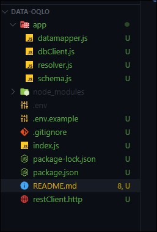
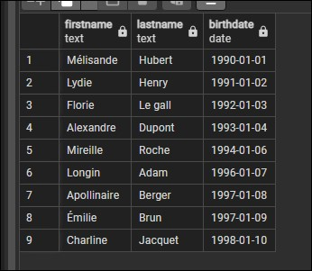
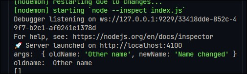
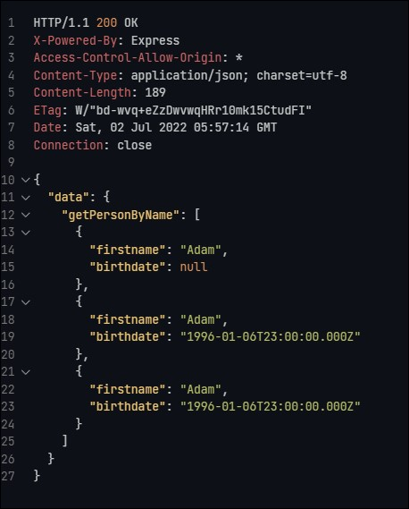
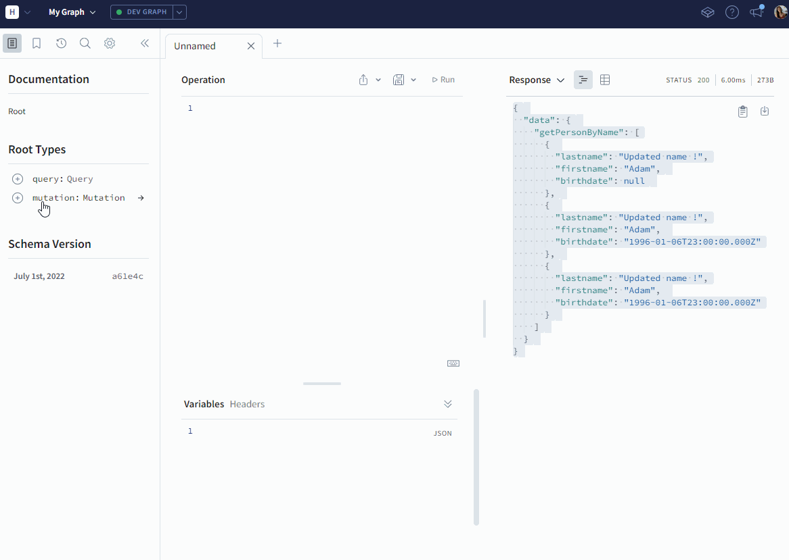
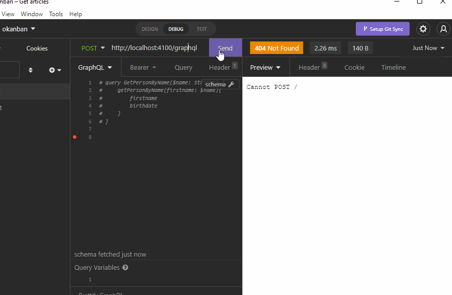

# O'Qlo - API

Author: Yumicode

## Introduction

Pour cette petite API, on veut seulement obtenir :

- nom de famille
- prénom
- date de naissance

Nous utiliserons GraphQL avec [Apollo Server](https://www.apollographql.com/docs/apollo-server/) qui est un serveur GraphQL open-source conforme aux spécifications et utiliserons un langage de définition de schéma (Schema Definition Language SDL).

Avec GraphQL, les développeurs peuvent récupérer uniquement ce qu'ils souhaitent. Il faudra définir les champs exacts que vous souhaitez récupérer et GraphQL récupèrera les données de ces champs uniquement.

L'es 'architecture de GraphQL est différente de l'API REST.

Ci-dessous, vous trouverez les différences entre les 2 (merci [O'Clock school](https://oclock.io/) pour le tableau)

|REST 📋|GraphQL 🧬|
|:-:|:-:|
|<u>-- **To embed** --</u>||
|Connect to DB|Connect to DB|
|Model|Model|
|Controller|Resolver|
|Logger|Logger|
|JWT|JWT|
|<u>-- **Schema GraphQL** --</u>||
|Validation|-|
|Route|-|
|Swagger Doc|-|
|<u>-- **Apollo Server functionnalities** --</u>||
|Exception|-|
|Error Handler|-|

Comme vous pouvez le voir, GraphQL inclut des validations depuis le `body`, il n'y a qu'une seule route, tout est fait pour que cela soit facile à utiliser.

Alors voyons comment ça marche !

## GraphQL et Apollo Server

Créons une API simple avec une seule table.

Tout d'abord, vous devez créer un dossier dans lequel nous initialisons npm

```
npm init
```

Nous aurons besoin de quelques dépendances :

- apollo-express-server (pour utiliser ApolloServer)
- pg (pour se connecter à la base de données)
- dotenv (pour définir et utiliser des variables d'environnement)
- express (pour faire fonctionner notre serveur !)

```
npm i apollo-server-express pg dotenv express
```

Ci-dessous vous trouverez la structure de nos fichiers :



### Créer et alimenter notre base de données

Avant de lancer notre serveur et de faire nos super requêtes, nous devons créer notre base de données.

J'utilise Postgres, voici les étapes que j'ai suivies :

- se connecter avec postgres

```sh
psql -U postgres
```

- création du role et du mot de passe

```sql
CREATE ROLE role_name WITH LOGIN PASSWORD 'password';
```

- création de la base de données

```sql
CREATE DATABASE database_name OWNER 'role_name';
```

Et enfin la création de notre monotable :

```sql
CREATE TABLE IF NOT EXISTS person (
    firstname TEXT NULL,
    lastname TEXT NULL,
    birthdate DATE NULL
);
```

Et enfin, remplissage de nos tables :

```sql
INSERT INTO public.person(
 lastname, firstname, birthdate)
 VALUES 
    ('Mélisande' ,'Hubert', '1/01/1990'),
    ('Lydie', 'Henry' , '2/01/1991'),         
    ('Florie', 'Le gall', '3/01/1992'),       
    ('Alexandre' ,'Dupont' ,'4/01/1993'),      
    ('Mireille' ,'Roche',  '6/01/1994'),        
    ( 'Longin', 'Adam','7/01/1996' ),        
    ('Apollinaire', 'Berger','8/01/1997' ),     
    ('Émilie', 'Brun' , '9/01/1997'),       
    ('Charline', 'Jacquet', '10/01/1998' );
```

Résultat sur PgAdmin (version 4)



### Index entry point pour notre server

Tout va démarrer sur notre fichier principal qui est index.js à la racine de notre dossier(ou app.js ou server.js).

Voyons comment le configurer avec Apollo Server :

```js
//~environment
import 'dotenv/config';

//~import modules
// CommonJS
// const express = require('express');
import express from 'express';
const app = express();
// CommonJS
// const { ApolloServer } = require("apollo-server-express");
import { ApolloServer } from 'apollo-server-express';

//~import schema and resolvers 
// CommonJS
// const typeDefs = require("./app/schema");
// const resolvers = require("./app/resolver");
import { schema } from './app/schema.js';
const typeDefs = schema ;

import { Query, Mutation } from './app/resolver.js';
const resolvers = { Query, Mutation };

const server = new ApolloServer({
  typeDefs,
  resolvers
});

const PORT = process.env.PORT ?? 3000;

//~Start Apollo Server
async function startServer() {
//Start instance Apollo Server
  await server.start();
// Link Express with Apollo server
  server.applyMiddleware({app});

    await app.listen(PORT);
    console.log(`🚀 Server launched on http://localhost:${PORT}`);

};

startServer();
```

Tout d'abord, importez dotenv pour lire votre fichier `.env` avec vos variables d'environnement.

Et puis importez votre module Express.

`apollo-server-express` est le package Apollo Server pour Express. Il vous permet d'attacher un serveur GraphQL à un serveur Express existant. Vous pourrez alors le lancer sur le même serveur.

Votre serveur GraphQL utilise un schéma pour décrire la forme de vos données disponibles.

Le `schema` définit tous les types utilisés à partir de la base de données et les `resolvers` renverrons les données en fonction nos méthodes. Ceux-ci sont chargés de récupérer les données de la base de données ou d'une API tierce.

Pour démarrer votre serveur, vous créez une instance du serveur Apollo et pour la lier à Express, vous devez utiliser `applyMiddleware` puis lancer le serveur

```js
const PORT = process.env.PORT ?? 3000;

//~Start Apollo Server
async function startServer() {
//Start instance Apollo Server
  await server.start();
// Link Express with Apollo server
  server.applyMiddleware({app});

    await app.listen(PORT);
    console.log(`🚀 Server launched on http://localhost:${PORT}`);

};

startServer();
```

### Connection à la base de données

Dans notre fichier dbClient.js nous allons créer la connexion à la base de données :

```js
import pg from 'pg';

const client = new pg.Client();
client.connect();

export {client};
```

### Datamapper

Avant de pouvoir récupérer les données par le biais de nos resolvers, nous allons tout d'abord créer nos requêtes dans le datamapper.

Pour notre  petite API, nous allons utiliser de simple opérations CRUD

- Read datas

```js
//~FETCH DATA
  async findAll() {
    const result = await client.query('SELECT * FROM "person";');

    return result.rows;
  },

  async findByName(name) {
    const result = await client.query(`SELECT * FROM "person" WHERE "firstname" = $1;`, [name]);

    return result.rows;
  },

  async findByDate(birthdate) {
    const result = await client.query('SELECT * FROM "person" WHERE "birthdate" = $1;', [birthdate]);

    return result.rows;
  },
```

- Create data

```js
//~CREATE DATA
  async insertPerson(person) {
    const preparedQuery = `INSERT INTO "person" ("firstname", "lastname", "birthdate") VALUES ($1, $2, $3) RETURNING *;`;

    const result = await client.query(preparedQuery, [person.firstname, person.lastname, person.birthdate]);

    return result.rows[0];
  },
```

- Update data

```js
 //~UPDATE DATA
  async updateByName(oldName, newName) {
    console.log('oldname: ', oldName);

    const result = await client.query('UPDATE "person" SET "lastname" = $1 WHERE "lastname" = $2 RETURNING *;', [newName, oldName]);
    console.log(result.rows);
    return result.rows[0];
  },
```

- Delete data

```js
  //~DELETE DATA
  async deleteByDate(date) {
    const preparedQuery = 'DELETE FROM "person" WHERE "birthdate" = $1 RETURNING *;';

    const result = await client.query(preparedQuery, [date]);
    console.log('Deleted : ', result.rowCount);

    let deletedInfo;
    //is the data deleted ? Return true if yes, return false if  not
    result.rowCount === 1 ? (deletedInfo = true) : (deletedInfo = false);

    //send a boolean
    return deletedInfo;
  }
```

Et bien sûr, il ne faudra pas oublier d'exporter ! ! ;)

### Resolvers

The resolvers are functions that's responsible for populating the data for a single field in your schema.

Vous aurez 2 types de resolvers : `Query` et `Mutation`

Query se concentre sur la récupération de données et le type de Mutation peut modifier les données côté serveur.

Le type Query ne lira que les informations, en SQL, c'est comme utiliser les commandes `SELECT` et `JOIN` (si vous avez plus d'une table).

Comment écrire un Query :

```js
const Query = {
    getAllPersons() {
        return dataMapper.findAll();
  },
  getPersonByName(parent, args, context, info) {
      const column = Object.keys(args)[0];
    
    return dataMapper.findByName(args.firstname, column);
  },
  //an example below of detructuring args parameter
  getPersonByDate(_, { date }) {
      return dataMapper.findByDate(date);
  }
};
```

La mutation renvoie un objet qui peut être utile pour récupérer le nouvel état d'un objet après sa mise à jour.

Les Mutations :

```js
const Mutation = {
  createPerson(_, args) {
    return dataMapper.insertPerson(args);
  },

  deleteByDate(_, args) {
    return dataMapper.deleteByDate(args.birthdate);
  },

  updateByName(_, args) {
    return dataMapper.updateByName(args.oldName, args.newName);
  }
};
```

#### `args` parameter

Le paramètre `args` prendra comme argument les informations envoyées par le `body`.



Comme vous pouvez le voir, c'est un objet.

Ici, pour accéder à l'ancien et au nouveau nom, vous avez 2 manières différentes de l'écrire :

`args` est un objet donc la première solution est :

```js
  updateByName(_, args) {
    return dataMapper.updateByName(args.oldName, args.newName);
  }
```

Ou par destructuration :

```js
  updateByName(_, {oldName, newName}) {
    return dataMapper.updateByName(oldName, newName);
  }
```

### Définir le schéma et les types

Pour cette simple API, voyons comment définir votre schéma : ici le code complet

```sh
import { gql } from 'apollo-server-express';

const schema = gql`
  #scalar is a type that you define if it's not a scalar default existing(Int, Float, String, Boolean and ID)
  scalar Date

  #define the table you use from your database
  type Person {
    lastname: String!
    firstname: String!
    birthdate: Date
  }

  type Query {
    getAllPersons: [Person]
    # here we declare 2 variables
    getPersonByName(lastname: String, firstname: String): [Person] # le name resolver will reach the name, so if you put firstname, you have to do a get(firstname)
    getPersonByDate(date: Date!): [Person]
  }

  # Any changes you can do to the database
  type Mutation {
    createPerson(lastname: String, firstname: String, birthdate: Date): Person
    deleteByDate(birthdate: Date!): Boolean
    updateByName(oldName: String!, newName: String!): Person
  }
`;
export { schema };
```

#### - Scalar

Le `scalar` est le type à définir pour les données que vous utilisez et les données que vous souhaitez renvoyer.

Les `scalar` par défaut existant sont les suivants :

`Int, Float, String, Boolean and ID`

Vous trouverez ici tous les GraphQL Scalars existant et possible à définir dans notre schema :

=> [Available Scalars types](https://www.graphql-scalars.dev/docs)

Pour intégrer cela, on pourra le mettre en haut du schema.

#### - Types from database

Après défini les `scalar`, vous devez créer des types pour chaque table que vous souhaitez utiliser de votre base de données et vous devez définir le type que vous souhaitez renvoyer.

```js
  #define the table you use from your database
  type Person {
    lastname: String!  // returns a String
    firstname: String!  // returns a String
    birthdate: Date  // returns a Date
  }
```

Ici, nous n'avons qu'une seule table. Chaque champ renvoie des données du type spécifié. Le type de retour d'un champ peut être un `scalar`, un objet, une énumération, une union ou une interface.

La marque `!` signifie que la valeur ne peut pas être `null`.

#### - Type Query

Le type Query définira les types de données que nous voulons en retour de nos `resolvers` et nous pouvons également définir les variables utilisées pour atteindre les données spécifiques.

Toutes les méthodes sont donc répertoriées dans notre fichier `resolvers.js`.

```js
type Query {
    getAllPersons: [Person]
    // here we declare 2 variables
    getPersonByName(lastname: String, firstname: String): [Person] 
    // name resolver will reach the name, so if you put firstname, you have precise that you want the to reach the firstname
    getPersonByDate(date: Date!): [Person]
  }
```

#### - Type Mutation

Les mutations venant de notre fichier `resolvers.js`


```js
  //Any changes you can do to the database
  type Mutation {
    createPerson(lastname: String, firstname: String, birthdate: Date): Person
    deleteByDate(birthdate: Date!): Boolean
    updateByName(oldName: String!, newName: String!): Person
  }
```

___
## Test sur la méthode du resolver getOnePerson

### Tests avec RestClient

Dans le fichier `.http` 

```sh
POST {{entrypoint}}
Content-Type: application/json
X-REQUEST-TYPE: GraphQL

query GetPersonByName($name: String!) {
    getPersonByName(firstname: $name){
        firstname
        birthdate
    }
}
#Variables
{"name": "Adam"}
```
Resultat :



### Tests avec Apollo Server Studio



### Tests avec Insomnia


___

### Resume

Donc afin de créer votre architecture GraphQL, vous pouvez utiliser Apollo Server lié à Express Server pour avoir plus de fonctionnalités (les Datasources et les Dataloaders ne sont pas utilisés dans notre API) et cela augmente la performance de notre API.

En résumé, étape par étape :

- Création d'une base de données et des tables

- Connexion à la base de données avec `pg`

- Création des requêtes dans le `datamapper`

- Utilisation des requêtes du datamapper pour créer des `resolvers`

- Importation des "resolver" dans votre type de requête pour envoyer le `schema` à Apollo Server

- Utilisation de la route unique `http://localhost:PORT/graphql` pour atteindre les données qu'on souhaite avec la méthode `POST` depuis le `body`

___

Sources que j'ai utilisé:

[GraphQL](https://graphql.org/)

[Apollo Server Documentation](https://www.apollographql.com/docs/apollo-server/)

[Articles why to use GraphQL](https://dzone.com/articles/why-and-when-to-use-graphql-1#:~:text=GraphQL%20allows%20making%20multiple%20resources,dependent%20resources%20on%20previous%20requests.)

[Available Scalars types](https://www.graphql-scalars.dev/docs)

[REST VS GraphQL](https://www.atatus.com/blog/rest-vs-graphql-everything-you-need-to-know/)
